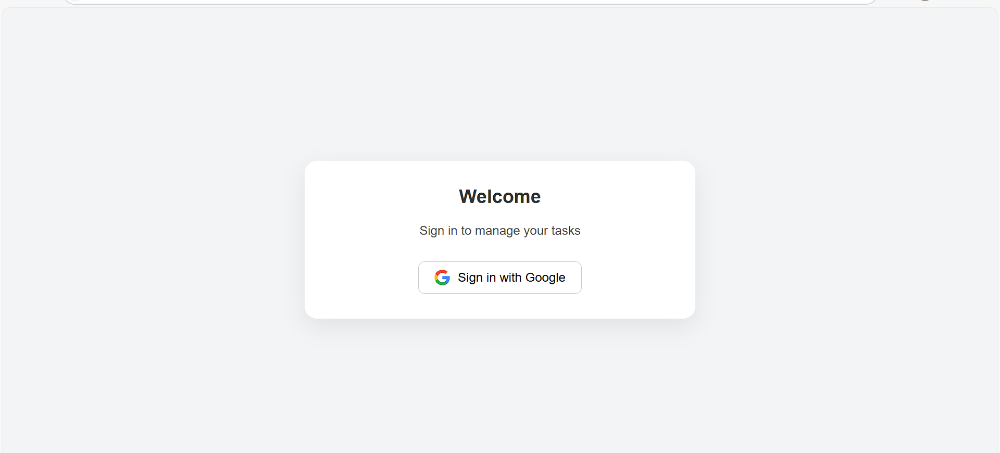
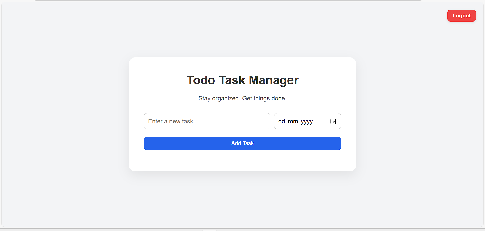

# ✅ Todo Task Manager (with Google Authentication)

A modern, responsive Todo Task Manager web application that allows users to:

- Sign in using **Google Authentication (Firebase)**
- Add, edit, complete, and remove tasks
- Automatically store and organize tasks with due dates and timestamps
- Responsive design with mobile support
- Automatically redirects signed-in users to the app and logs out securely

---

## 🔐 Features

- Google Sign-In via Firebase Authentication
- Protected route access (`index.html` blocked unless logged in)
- Task management with:
  - Editable task content
  - Created and due timestamps
  - Completion with checkbox
  - Inline editing via double-click
  - Real-time task separation (Active vs Completed)
- Clean and responsive UI

 ---

## 🛠️ Built With

- HTML5 + CSS3 + JavaScript
- Firebase Authentication
- Netlify (deployment)
- Git + GitHub (version control)

---

- ## 📱 Screenshots

| Login Page | Homepage |
|------------|----------|
|  |  |

---

🎥 [Watch Demo Video](https://drive.google.com/file/d/1v2OcIJ4o3XjVzoiwTtF4HC4Y9mq0aMsS/view?usp=drive_link)

This project is a part of a hackathon run by https://www.katomaran.com
